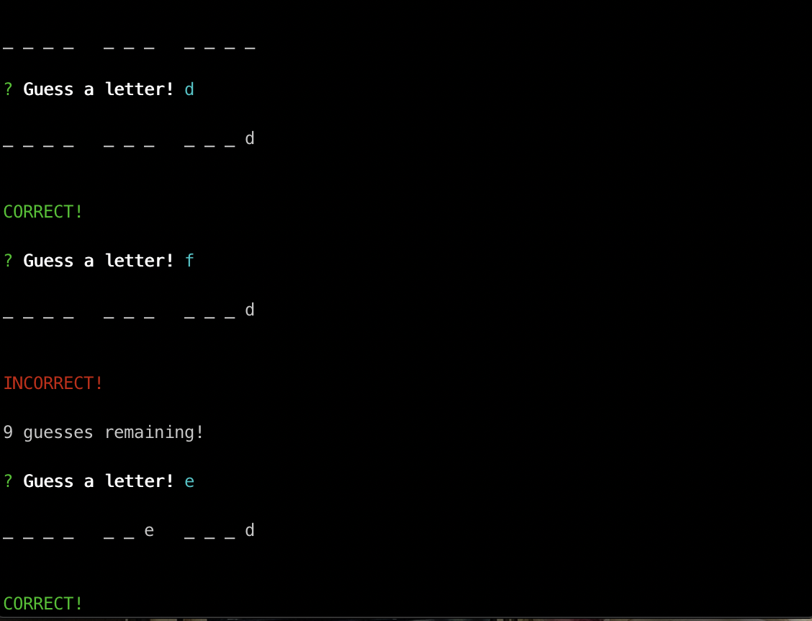
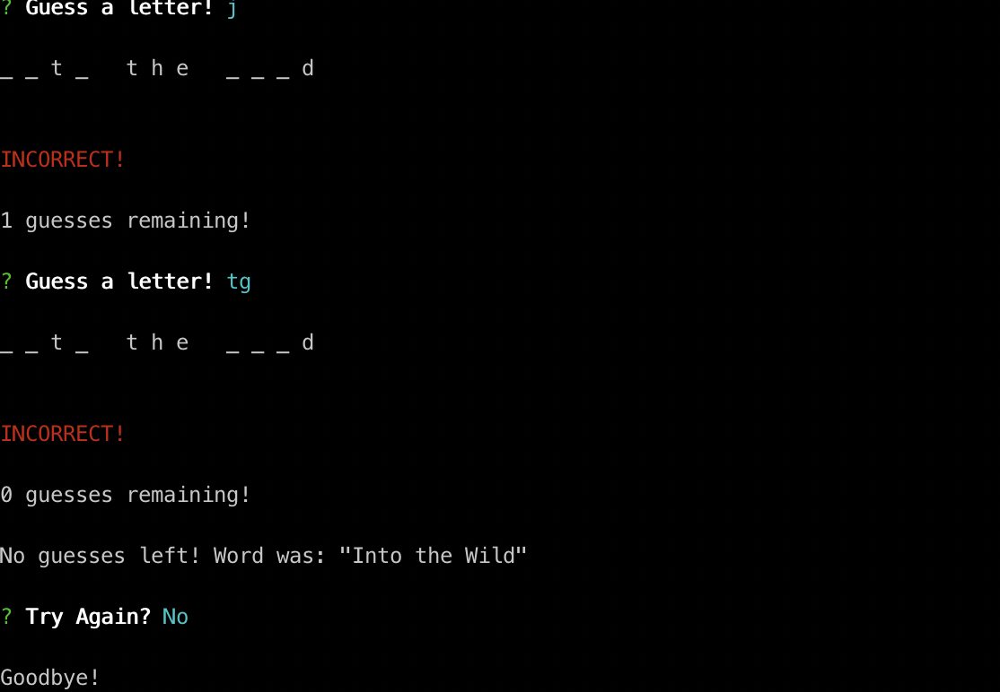

# wordguess

 Word Guess command-line game using constructor functions.
 
  * * * receive user input using the `inquirer` or `prompt` npm packages.

The Word Guess game is based on IMDB Top 250 Movies.

JavaScript, NodeJS, 
NPMs: inquirer & prompt

 

